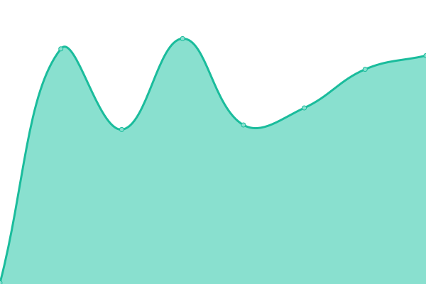
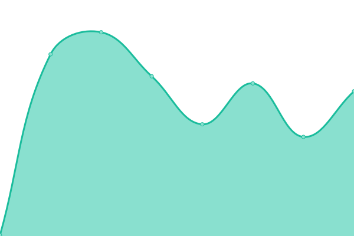
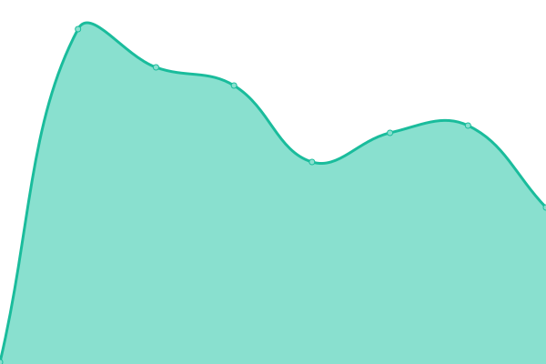
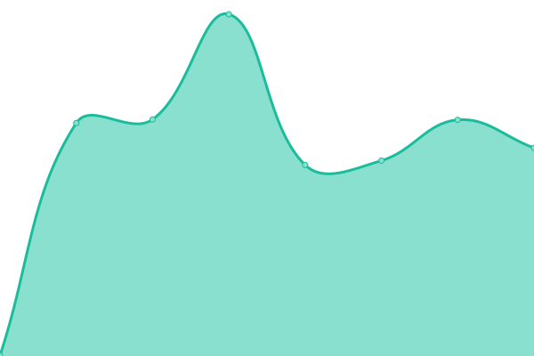
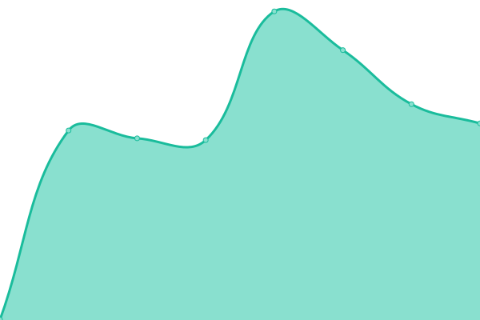

# [📈 Live Status](https://status.kordex.dev): <!--live status--> **🟧 Partial outage**

This repository contains the open-source uptime monitor and status page for [Kord Extensions](https://kordex.dev), powered by [Upptime](https://github.com/upptime/upptime).

With [Upptime](https://upptime.js.org), you can get your own unlimited and free uptime monitor and status page, powered entirely by a GitHub repository. We use [Issues](https://github.com/Kord-Extensions/status/issues) as incident reports, [Actions](https://github.com/Kord-Extensions/status/actions) as uptime monitors, and [Pages](https://status.kordex.dev) for the status page.

<!--start: status pages-->
<!-- This summary is generated by Upptime (https://github.com/upptime/upptime) -->
<!-- Do not edit this manually, your changes will be overwritten -->
<!-- prettier-ignore -->
| URL | Status | History | Response Time | Uptime |
| --- | ------ | ------- | ------------- | ------ |
|  [Website](https://kordex.dev) | 🟥 Down | [website.yml](https://github.com/Kord-Extensions/status/commits/HEAD/history/website.yml) | 

 280ms
     
 | 

<a href="https://status.kordex.dev/history/website">98.53%</a>
    

|  [Docs](https://docs.kordex.dev) | 🟥 Down | [docs.yml](https://github.com/Kord-Extensions/status/commits/HEAD/history/docs.yml) | 

 194ms
     
 | 

<a href="https://status.kordex.dev/history/docs">98.63%</a>
    

|  [Dokka](https://dokka.kordex.dev) | 🟩 Up | [dokka.yml](https://github.com/Kord-Extensions/status/commits/HEAD/history/dokka.yml) | 

 195ms
     
 | 

<a href="https://status.kordex.dev/history/dokka">98.71%</a>
    

|  [Maven Repo](https://repo.kordex.dev) | 🟩 Up | [maven-repo.yml](https://github.com/Kord-Extensions/status/commits/HEAD/history/maven-repo.yml) | 

 595ms
     
 | 

<a href="https://status.kordex.dev/history/maven-repo">98.71%</a>
    

|  [Statistics Dashboard](https://stats.kordex.dev/public/dashboard/4b0a4faa-45fb-45af-ab96-43cfbec11779) | 🟩 Up | [statistics-dashboard.yml](https://github.com/Kord-Extensions/status/commits/HEAD/history/statistics-dashboard.yml) | 

 660ms
     
 | 

<a href="https://status.kordex.dev/history/statistics-dashboard">98.59%</a>
    

|  [Data Collection Service](https://data.kordex.dev) | 🟩 Up | [data-collection-service.yml](https://github.com/Kord-Extensions/status/commits/HEAD/history/data-collection-service.yml) | 

 540ms
     
 | 

<a href="https://status.kordex.dev/history/data-collection-service">99.10%</a>
    

<!--end: status pages-->

[**Visit our status website →**](https://status.kordex.dev)

## 📄 License

- Powered by: [Upptime](https://github.com/upptime/upptime)
- Code: [MIT](./LICENSE) © [Anand Chowdhary](https://anandchowdhary.com), supported by [Pabio](https://pabio.com)
- Data in the `./history` directory: [Open Database License](https://opendatacommons.org/licenses/odbl/1-0/)
